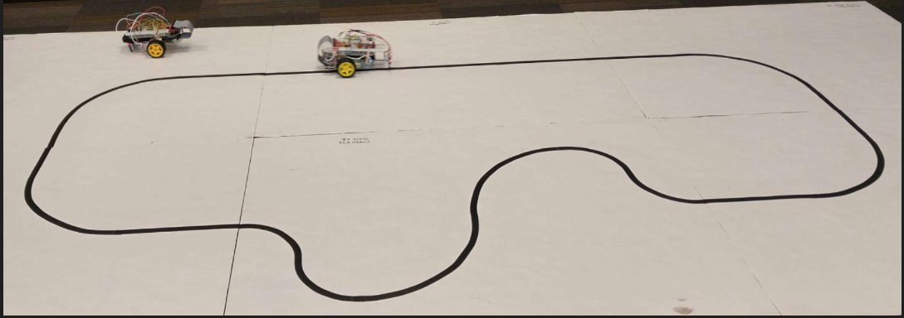
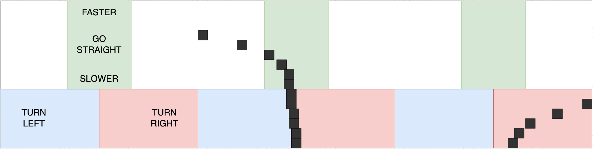
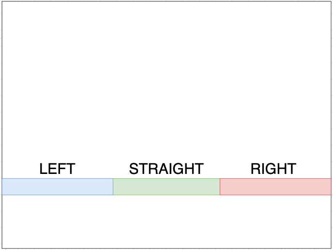

# raspberry-car

This project spanned the majority of the Microcontrollers Class I took during the Spring 2023 semester. This was a follow-up to the class I took in the Fall 2022 semester where we programmed highly time-accurate code in the CPU12 Assembly language, this class was much different as it was entirely in C. After some preliminary projects learning how to operate the I/O pins in the Pi with PWM, we dove into constructing and programming our RC cars.

A few things to note. First, this class was fairly unorganized, with no planned lectures, and wildly inconsistent workloads from week to week. Best practices and tips and tricks were rarely discussed. This leads directly to the second point, the massive amount of commits. Having very little prior experience with SSH, and not knowing VSCode could edit code via SSH, I developed on my computer and used GitHub as the world's slowest SSH. Pretty embarrassing, but hey we all make mistakes. 

## What I Learned
#### Technical Skills
- SSH
- PWM
#### Practical Skills
- The first idea is usually not a good solution.
	- For controlling the left and right wheels, the professor recommended two separate threads, despite the fact they always work in tandem.
	- For the replay mode, the professor recommended using the motion capture data to replicate the driving pattern, instead of just capturing the commands.
- Eat the frog.
	- Specifically, it's usually quicker to add onto a broken design than to fix serious internal issues. I was late on an assignment halfway through the class, as I decided to 'eat the frog' and restructure much of the core design. It was well worth it in the end.
## Car Functionality

#### Manual Driving Mode
1) **s**: Stop
2) **w**: Forward
3) **x**: Backward
4) **i**: Faster (5% PWM power increase)
5) **j**: Slower (5% PWM power decrease)
6) **a**: Left (15-degree turn)
7) **d**: Right (15-degree turn)

#### Autonomous Track Driving with IR Proximity Sensors
With a high contrast in the amount of reflected light between the two surfaces, an Infrared, or IR, proximity sensor can be calibrated to trigger on the lighter surface and not the darker surface, despite a constant proximity. In this class, this was done by using white poster board for the driving surface (Or, for my at-home testing, the floor of the bathroom. Sorry roommates!), and black electrical tape for the track. 

To achieve autonomous driving, two sensors were placed on the front of the car, pointing down, slightly wider than the tape. When the car was driving straight on the track, both proximity sensors would signal a nearby object, as the light floor reflected enough of the IR light to pass the calibrated threshold. However, when the track turned, or the car went off course, one of the sensors would go over the track. The dark track, not reflecting enough light, flipped the signal. If the left sensor was triggered, the car turned left, and if right, right.

Due to the tertiary nature of the signal (straight, left, or right), the degree of the turn could not be accounted for, and the worst had to be assumed. All degrees of turns were accounted for by adding a delay when a turn was triggered. This had to be tuned so the car would never overturn and go completely off the track, but still turn enough to not speed through tight corners.

#### Motion Data Capture
The car was outfitted with an MPU-9250 chip, an Inertial measurement unit (IMU) that contains an accelerometer, gyroscope, and magnetometer. Users could record for either a five-second interval, or until the car was stopped. The data would then be saved for later analysis.

#### Autonomous Driving: Following a Laser Pointer.
To follow a laser pointer around, the car was outfitted with a camera module. Every few program clock cycles, the camera would capture an image. The image was then downsampled for quicker processing. If a peak of light matching the color of the laser pointer was detected in the image, the car would first turn in place to line up with the laser point, then drive forward to get to the preset distance from the point. The threshold for detecting a laser was determined by the light in the room. The user could recalibrate the threshold when lighting conditions changed, allowing for very accurate results in a dark room, while still allowing functionality in a light room.

#### Autonomous Track Driving with Image Processing
The same high-contrast track discussed above could be followed the same way using only the camera and some image processing. Just like with the laser pointer, the camera could be calibrated, would take a photo every few program clock cycles, and the image was downsampled. However, this time, much more data could be garnered by the image.

The original plan was to determine how far off-center the track was throughout the image, by finding the median of dark pixels on each horizontal row sampled. The farther the track stretched forward, the faster the car would go. Once the track diverged close enough to the car, it would begin to turn. This is demonstrated below:

The left graphic shows the different zones. The middle graphic shows the track diverging to the left, but past the point where it would turn. The final graphic on the right shows the track diverging early enough that the car would turn right.

However, the much more simplistic design that made it into production was a basic replication of the IR design. A single horizontal row, near the car, would be scanned. If the track was straight, the car would speed up, and if it was turning, the car would slow down and turn in the appropriate direction. This much less flashy but functional design is demonstrated below:

Here, the median of the dark pixels in the single sampled row determined the direction and speed of the car.

#### Drive Replay
Last but not least, the ability for users to replay a drive. Users could signal their intention to record when the car was stopped. Recording would start when the car started moving, and end when it came to a stop. Then they could trigger the replay. This was accomplished by simply recording the commands the user inputted, as well as the timing of the commands, and then replaying that series of commands. 